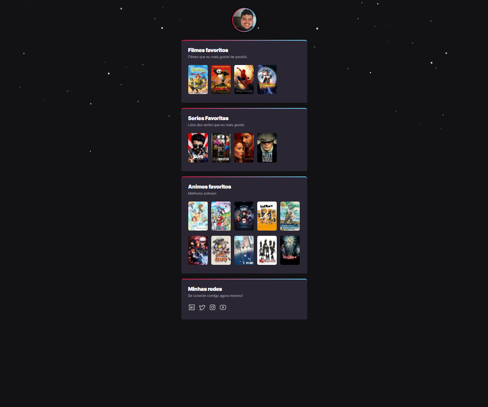

# NLW eSports Extra

> Trilha Explorer(Codigo Extra)

Projeto construído no evento NLW(Next Level Week) da Rocketseat.
Codigo extra requerido no final do evento.

[🔗 Clique aqui para acessar.](https://joao7001.github.io/nlw-esports-extra)

## ⚙ Tecnologias

  
  

## 📞 Contato

- ujoaoo7001@gmail.com
- [Outros meios de contato](https://beacons.ai/joao7001)
